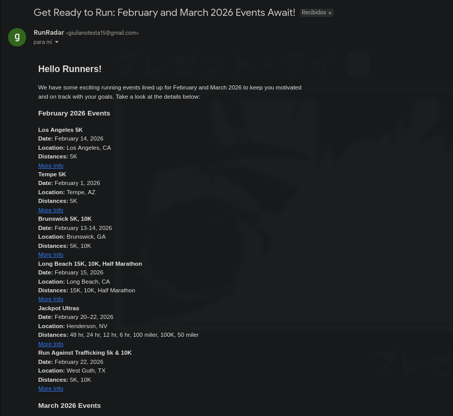

# RunRadar

AI-powered multi-agent app that discovers upcoming running/cycling events in a specified country and sends a curated newsletter by email.

---

## What it does

RunRadar orchestrates multiple agents to:
- Generate targeted web search queries for a country
- Discover upcoming running/cycling events on the web
- Validate + deduplicate results
- Write a professional newsletter (optionally multilingual)
- Convert it into email-safe HTML
- Send it via the configured provider

---

## Quickstart

### 1) Install

~~~bash
git clone <repository-url>
cd run-radar/app
uv sync
~~~

Using pip:

~~~bash
pip install -e .
~~~

### 2) Configure

Create a `.env` file (see `.env.example`).

~~~env
OPENAI_API_KEY=...
OPENAI_MODEL=gpt-4o-mini
BRAVE_API_KEY=...
COUNTRY=Argentina
HOW_MANY_SEARCHES=6

EMAIL_PROVIDER=gmail
GMAIL_EMAIL=...
GMAIL_APP_PASSWORD=...

RECIPIENT_EMAIL=...
SENDER_EMAIL=...
SENDER_NAME=RunRadar
~~~

### 3) Run

~~~bash
uv run python main.py
~~~

~~~text
[LOG] Starting workflow...
[LOG] Running search_manager_agent for: February 2026 and March 2026
[TOOL] web_search called with query: ...
[TOOL] send_email called with subject: ...
[LOG] Workflow completed: ... successfully sent!
[LOG] Workflow finished.
~~~

RunRadar will:
1. Compute a search window (e.g., next ~2 months)
2. Generate and execute multiple searches
3. Deduplicate results
4. Compose + validate the newsletter
5. Send an HTML email

---

## Architecture (Agents)

### Search
- **Search Plan Agent**: generates the best search queries for the target country
- **Search Agent**: executes searches (Brave Search API)
- **Search Manager Agent**: orchestrates searches, aggregates + deduplicates events

### Email
- **Email Writer Agent**: writes the newsletter body in the appropriate language
- **Subject Writer Agent**: produces a subject line (35–70 characters)
- **HTML Converter Agent**: converts content to email-safe HTML (tables)
- **Email Validator Agent**: validates content before sending
- **Email Manager Agent**: orchestrates email composition + delivery

### Flow

~~~text
main()
  └→ Search Manager Agent
      ├→ Search Plan Agent
      ├→ Search Agent
      └→ handoff → Email Manager Agent
          ├→ Email Writer Agent
          ├→ Subject Writer Agent
          ├→ HTML Converter Agent
          ├→ Email Validator Agent
          └→ send_email()
~~~

---

## Configuration

| Variable | Description | Required |
|----------|-------------|----------|
| `OPENAI_API_KEY` | OpenAI API key | Yes |
| `OPENAI_MODEL` | OpenAI model (default: `gpt-4o-mini`) | No |
| `BRAVE_API_KEY` | Brave Search API key | Yes |
| `COUNTRY` | Target country for events | Yes |
| `HOW_MANY_SEARCHES` | Number of search queries | Yes |
| `EMAIL_PROVIDER` | `resend` or `gmail` | Yes |
| `RESEND_API_KEY` | Resend API key | If using Resend |
| `GMAIL_EMAIL` | Gmail address | If using Gmail |
| `GMAIL_APP_PASSWORD` | Gmail app password | If using Gmail |
| `RECIPIENT_EMAIL` | Subscriber email | Yes |
| `SENDER_EMAIL` | From email address | Yes |
| `SENDER_NAME` | From display name | Yes |

---

## Roadmap (ideas)

- Subscriber lists / multiple recipients
- Scheduling (cron)
- Docker 

---

## License

MIT License — see `LICENSE`.